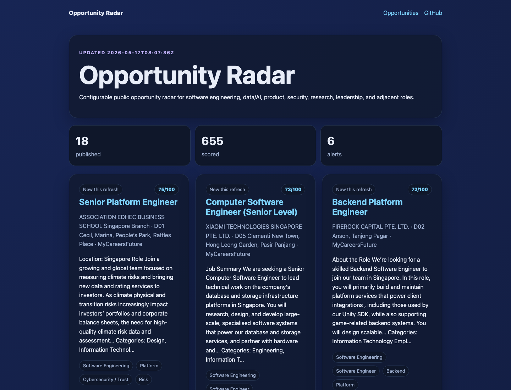

# Merlion Radar

**Merlion Radar** is a Singapore-first, static GitHub Pages job/opportunity radar that anyone can adapt to their own career focus.



It is intentionally **not limited to AI security**. Configure it for software engineering, data science, product, design, security, research, marketing, leadership, or any mix of roles.

## What it does

- Pulls public roles from Greenhouse, Lever, Ashby, Remotive, RemoteOK, Singapore's MyCareersFuture portal, and optional custom JSON feeds.
- Scores roles against configurable career signals, locations, title terms, and exclusion terms.
- Publishes a static `/opportunities/` page that works on GitHub Pages/Jekyll.
- Adds per-role guidance:
  - why the role matches
  - next action
  - skillsets to build
  - certifications/courses to consider
  - learning gaps to close
- Keeps privacy-safe history keys so trend badges do not require storing raw job URLs in history.
- Runs in GitHub Actions with Python standard library only; no secrets required for public feeds.
- Optional LLM enrichment works with OpenAI-compatible endpoints, Anthropic, Gemini, or any compatible gateway, using environment-variable secrets only.

## Quick start

1. Use this repository as a template or fork it.
2. Edit `config/opportunity_radar.json`:
   - `site_url`
   - `max_items`
   - `location.include_terms`
   - `role_profiles`
   - public ATS boards under `sources`
3. Run locally:

```bash
python3 scripts/update_opportunities.py
python3 scripts/validate_opportunities.py
```

4. Enable GitHub Pages for the repository.
5. The included GitHub Actions workflow refreshes `_data/opportunities.json` on a schedule and validates it before committing.

## Configure career focus

Each `role_profiles` entry defines what you care about:

```json
{
  "label": "Data / AI Engineering",
  "terms": ["machine learning", "data platform", "mlops", "llm", "analytics engineering"],
  "skillsets": ["Production ML systems, data pipelines, model evaluation, and observability."],
  "certifications": ["Cloud data/ML engineer certification aligned to your target provider."],
  "learning_gaps": ["Show an end-to-end project with data ingestion, training/evaluation, deployment, and monitoring."]
}
```

You can add any domain. The generator treats profiles as scoring dimensions and learning-plan templates.

## Optional LLM enrichment

The radar does **not** require an LLM or API key. By default, `config/opportunity_radar.json` has `llm.enabled` set to `false`, and the deterministic profile guidance is used.

If you want model-generated guidance, enable the `llm` block and store the real key outside the repo as an environment variable or GitHub Actions secret. The config should contain only the variable name, never the secret value:

```json
"llm": {
  "enabled": true,
  "provider": "openai_compatible",
  "model": "gpt-4o-mini",
  "base_url": "https://api.openai.com/v1",
  "api_key_env": "OPENAI_API_KEY",
  "max_items_to_enrich": 6
}
```

Supported providers:

- `openai_compatible`: OpenAI, OpenRouter, Together, Fireworks, local gateways, or any `/chat/completions` compatible endpoint. Set `base_url` and `model` for your provider.
- `anthropic`: uses `/v1/messages`; set `model` such as a Claude model and `api_key_env` such as `ANTHROPIC_API_KEY`.
- `gemini`: uses Google Generative Language `generateContent`; set `model` such as `gemini-1.5-flash` and `api_key_env` such as `GEMINI_API_KEY`.

For GitHub Actions, add the key in **Settings → Secrets and variables → Actions**, then expose it to the generate step, for example:

```yaml
env:
  OPENAI_API_KEY: ${{ secrets.OPENAI_API_KEY }}
```

Security guardrails:

- Do not commit literal API keys, bearer tokens, passwords, or private feed credentials.
- The validator rejects token/API-key-looking values and config fields such as `api_key`, `token`, `secret`, or `password` when they contain values.
- LLM output is still validated for required fields and public-data privacy constraints before publishing.

## Add sources

Supported public source types:

- `greenhouse`: `{ "company": "Anthropic", "board": "anthropic" }`
- `lever`: `{ "company": "Mistral AI", "slug": "mistral" }`
- `ashby`: `{ "company": "OpenAI", "board": "openai" }`
- `remotive`: configured with search queries; set to an empty list when you want a Singapore/APAC-only run.
- `remoteok`: broad remote feed; set to `false` when remote/global jobs should not compete with local Singapore results.
- `mycareersfuture_queries`: Singapore portal searches, for example `["software engineer", "cybersecurity engineer", "product manager"]`; optional `mycareersfuture_limit` controls rows per query.
- `custom_json`: point at a JSON endpoint, an optional local JSON file, or inline `items`, then map fields.

Singapore/APAC tuning options:

- `location.exclude_terms` can block broad non-local matches such as `remote`, `us`, `remote us`, `usa`, `canada`, and `americas`.
- `source_boosts` can lift trusted Singapore/APAC sources such as MyCareersFuture, GovTech Singapore, Airwallex, OKX, or a custom Singapore/APAC feed.
- `source_minimums` can reserve published slots for important local sources so global ATS boards do not dominate the page.

Example custom feed backed by `config/custom_opportunities.json`:

```json
{
  "name": "Custom Singapore/APAC feed",
  "path": "config/custom_opportunities.json",
  "optional": true,
  "items_path": "jobs",
  "defaults": {"location": "Singapore / APAC"},
  "fields": {
    "title": "title",
    "company": "company",
    "location": "location",
    "url": "url",
    "summary_fields": ["summary", "description", "tags"],
    "published_at": "published_at"
  }
}
```

## Safety and privacy defaults

- No credentials are needed for the included public feeds.
- History stores hashed role keys, not raw job URLs.
- The validator blocks email addresses, mail-to-style links, and likely phone numbers in generated public data.
- If you add private/internal feeds, keep secrets out of this repo and update the workflow to read them from GitHub Actions secrets.

## Files

- `config/opportunity_radar.json` — main configuration.
- `scripts/update_opportunities.py` — fetch, score, rank, and write data.
- `scripts/validate_opportunities.py` — quality and privacy gate.
- `_data/opportunities.json` — generated public data rendered by Jekyll.
- `_data/opportunities_history.json` — generated privacy-safe trend history.
- `opportunities.md` — public page.

## License

MIT.
